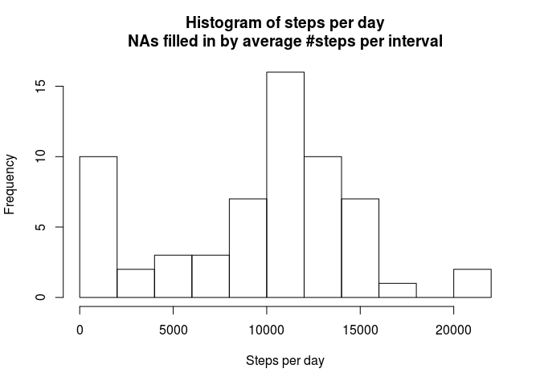

# Reproducible Research: Peer Assessment 1

## Loading and preprocessing the data

Loading the data from the CSV file is straightforward:


```r
activity <- read.csv("activity.csv")
str(activity)
```

```
## 'data.frame':	17568 obs. of  3 variables:
##  $ steps   : int  NA NA NA NA NA NA NA NA NA NA ...
##  $ date    : Factor w/ 61 levels "2012-10-01","2012-10-02",..: 1 1 1 1 1 1 1 1 1 1 ...
##  $ interval: int  0 5 10 15 20 25 30 35 40 45 ...
```

No preprocessing is necessary. The columns of the data already have sensible names. There are NAs in the data but we'll take care of them later.

## What is mean total number of steps taken per day?

Group first by date, then summarize by counting the number of steps for each group:


```r
library(dplyr)

steps.per.day <- activity %>%
    group_by(date) %>%
    summarize(total.n.steps = sum(steps, na.rm = TRUE))

hist(steps.per.day$total.n.steps,
     breaks = 10,
     main = "Histogram of steps per day",
     xlab = "Steps per day")
```

<!-- -->

Now let's calculate the mean and median number of steps per day:


```r
mean(steps.per.day$total.n.steps)
```

```
## [1] 9354.23
```


```r
median(steps.per.day$total.n.steps)
```

```
## [1] 10395
```

## What is the average daily activity pattern?

First we need to group by interval. This allows us to calculate the average number of steps per 5-minute interval, averaged over days:


```r
mean.steps.per.interval <- activity %>%
      group_by(interval) %>%
      summarize(mean.total.n.steps = mean(steps, na.rm = TRUE))

with(mean.steps.per.interval,
     plot(x = interval,
          y = mean.total.n.steps,
          type = "l",
          main = "Number of steps per interval\naveraged over days",
          xlab = "Interval",
          ylab = "Average number of steps"))
```

<!-- -->

From there, it's easy to find the 5-minute interval where on average the person made the most steps per day:


```r
max.row <- which.max(mean.steps.per.interval$mean.total.n.steps)
mean.steps.per.interval$interval[max.row]
```

```
## [1] 835
```

## Imputing missing values

There are quite a few NAs in the step column of the data. But how many exactly?


```r
missing.rows <- is.na(activity$steps)
sum(missing.rows)
```

```
## [1] 2304
```

Now, one way to fill in missing values for step is to take the median number of steps per interval (the median is a better choice because it is not influenced by outliers and it picks one of the steps, so the number is guaranteed to be integer):


```r
median.steps.per.interval <- activity %>%
      group_by(interval) %>%
      summarize(median.total.n.steps = median(steps, na.rm = TRUE))

fill.values <- rep(median.steps.per.interval$median.total.n.steps, times = length(unique(activity$date)))

activity.without.nas <- activity
activity.without.nas$steps[missing.rows] <- fill.values[missing.rows]
str(activity.without.nas)
```

```
## 'data.frame':	17568 obs. of  3 variables:
##  $ steps   : int  0 0 0 0 0 0 0 0 0 0 ...
##  $ date    : Factor w/ 61 levels "2012-10-01","2012-10-02",..: 1 1 1 1 1 1 1 1 1 1 ...
##  $ interval: int  0 5 10 15 20 25 30 35 40 45 ...
```

Let's have a look at the result:


```r
steps.per.day.without.nas <- activity.without.nas %>%
    group_by(date) %>%
    summarize(total.n.steps = sum(steps))

hist(steps.per.day.without.nas$total.n.steps,
     breaks = 10,
     main = "Histogram of steps per day\nNAs filled in by average #steps per interval",
     xlab = "Steps per day")
```

<!-- -->


```r
mean(steps.per.day.without.nas$total.n.steps)
```

```
## [1] 9503.869
```


```r
median(steps.per.day.without.nas$total.n.steps)
```

```
## [1] 10395
```

The histogram looks very similar to the one of the original data. The median is even exactly the same. Only the mean is slightly different. This means that imputing missing values only has a small effect on the estimates of the total number of steps per day.

## Are there differences in activity patterns between weekdays and weekends?

To answer this question, first create a factor variable for whether a date falls on a weekday or a weekend:


```r
activity.without.nas <- activity.without.nas %>%
    mutate(part.of.week = factor(weekdays(as.Date(date)) %in% c("Saturday", "Sunday"),
              labels = c("weekday", "weekend")))

table(activity.without.nas$part.of.week)
```

```
## 
## weekday weekend 
##   12960    4608
```

Using lattice, we can now create a panel plot that compares the number of steps per interval averaged over weekdays and weekends:


```r
sum(is.na(activity.without.nas$step))
```

```
## [1] 0
```

```r
sum(is.na(activity.without.nas))
```

```
## [1] 0
```

```r
activity.patterns <- activity.without.nas %>%
    group_by(interval, part.of.week) %>%
    summarize(mean.total.n.steps = mean(steps))

library(lattice)
with(activity.patterns,
     xyplot(mean.total.n.steps ~ interval | part.of.week, layout = c(1, 2),
            type = "l",
            xlab = "Interval",
            ylab = "Average number of steps"))
```

<!-- -->

It seems that on a weekday the person walks more in eary morning to get to work. However, the person walks more often during the day on weekends so it's probably an office worker. On weekends the person also walks more in the evening, so either going to bed earlier or staying in front of the TV more often on weekdays.

